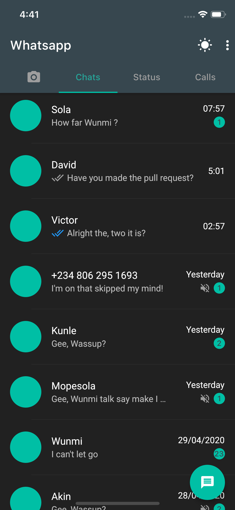
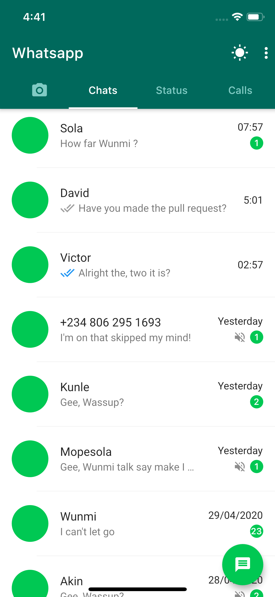
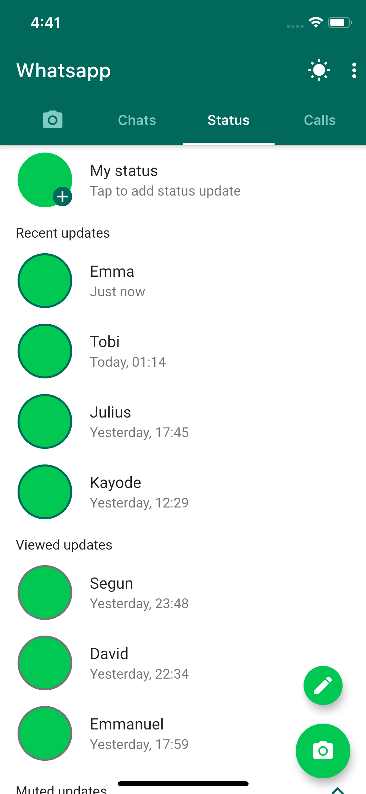
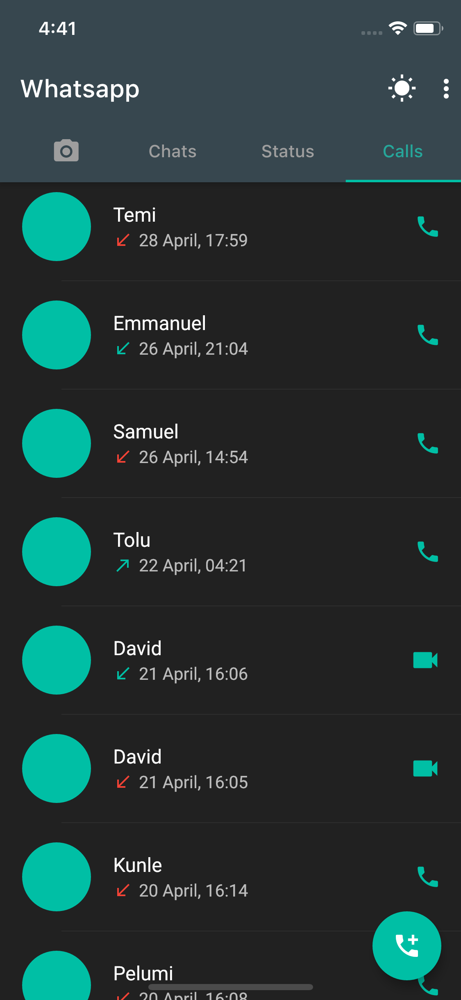
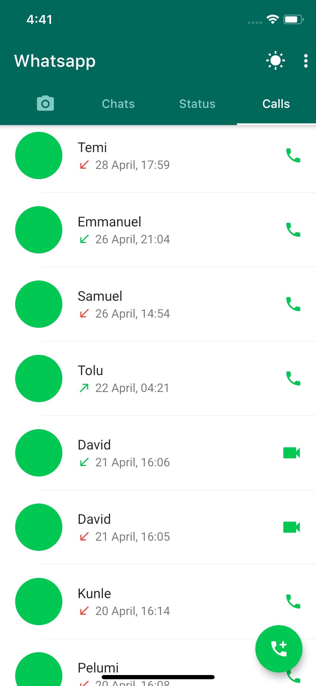

# whatsapp_clone

A  mini Whatsapp clone made with Flutter.

## Getting Started

This project is a starting point for a Flutter application.

### The screenshots below are taken on a iOS simulator.

| Chat Screen                                           | Chat Screen                                         |
| ------------------------------------------- | ----------------------------------------- |
|  |  |

| Status Screen                                         | Status Screen                                         |
| ----------------------------------------- | ----------------------------------------- |
|  |  |

| Calls Screen                                         | Calls Screen                                         |
| ----------------------------------------- | ----------------------------------------- |
|  |  |

A few resources to get you started if this is your first Flutter project:

- [Lab: Write your first Flutter app](https://flutter.dev/docs/get-started/codelab)
- [Cookbook: Useful Flutter samples](https://flutter.dev/docs/cookbook)

For help getting started with Flutter, view our
[online documentation](https://flutter.dev/docs), which offers tutorials,
samples, guidance on mobile development, and a full API reference.
